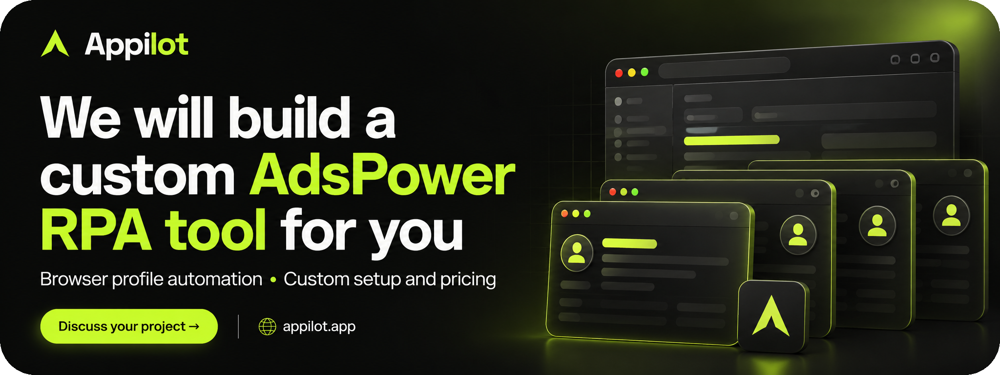
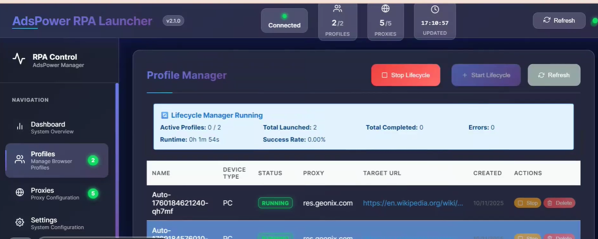

# Python RPA Automation Tool — AdsPower

[](https://www.appilot.app/contact)

**Appilot custom AdsPower profile automation showcase and Python-oriented RPA blueprint for browser workflows, lifecycle controls and task monitoring.**

## Overview

This Python RPA automation tool showcase describes an AdsPower browser-profile workflow and a custom development brief. Thelauncher screenshot shows profile lifecycle controls and operational status. Python is the requested implementation direction, not a verified claim about the application shown.

## Watch the Demo

[Watch the project demo](https://youtu.be/OaMOgxoPBWo)

## What the Software Can Manage

| Area | Evidence or proposed scope |
|---|---|
| Profile lifecycle | The supplied UI shows start and stop lifecycle controls and profile rows. |
| Operational status | The UI displays runtime, launched/completed counts and errors. |
| Profile context | The UI shows device type, proxy, target URL and status fields. |
| Python integration | A Python orchestration layer can be evaluated as part of the custom build; no implementation is included here. |

## Typical Use Cases

- Repeatable browser operations across authorized business profiles.
- Supervised browser workflow testing with profile-specific settings.
- Centralized run monitoring and exception review.

## How It Works

The following is the proposed delivery workflow, not an installation guide:

1. **Define the task.** Share a recording of the manual process and identify authorized accounts, devices or profiles.
2. **Agree boundaries.** Specify permitted actions, exclusions, completion criteria and when an operator must take over.
3. **Prepare a pilot.** Validate the environment and demonstrate a limited workflow with non-sensitive test inputs.
4. **Review outcomes.** Check normal completion, unexpected screens, interruption and recovery. Stop when the outcome is uncertain.
5. **Approve handoff.** Confirm configuration, access controls, operating instructions and support responsibilities.

##  Screenshot

### AdsPower RPA profile manager




## Core Modules

These are proposed implementation responsibilities; the production stack and module boundaries must be confirmed during discovery.

| Module | Purpose |
|---|---|
| Task configuration | Capture approved scope, inputs and completion criteria. |
| Account or profile context | Validate the intended authorized execution environment. |
| Workflow runner | Perform the agreed steps with bounded execution. |
| Operator controls | Provide stopping, review and recovery paths. |
| Outcome reporting | Record minimal status and exceptions without secrets. |


## Repository Structure

```text
python-rpa-automation-tool/
  assets/
    banner.png
    adspower-profile-manager.png
  docs/
    architecture.md
    media-notes.md
  .gitignore
  CONTRIBUTING.md
  LICENSE
  README.md
  REPOSITORY-SETUP.md
  SECURITY.md
```

## Customization Options

- Python integration feasibility and supported APIs
- Profile selection and approved target sites
- Task completion checks and error escalation
- Reporting, deployment and support requirements

## Frequently Asked Questions

### Can the workflow be adapted to my business?

Appilot can evaluate your process, devices and integration requirements. Share a representative manual workflow without secrets and agree a limited pilot before expanding the scope.

### Are the screenshots real?

They are user-supplied project screenshots, preserved unchanged. Captions distinguish what is visible from what still needs to be implemented or verified. 

### Is this an official platform product?

No endorsement or affiliation with Instagram, Meta, AdsPower or Reddit is implied. Names identify the relevant workflow environment.

## Build Your Custom Automation Tool

**Appilot can help scope a custom tool around your workflow.** Bring the repetitive task; agree the controls, success criteria and support you need.


[Visit Appilot](https://www.appilot.app/) · [Contact Appilot](https://www.appilot.app/contact)

